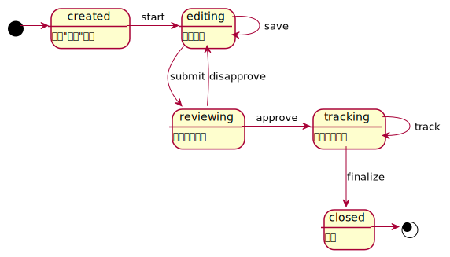
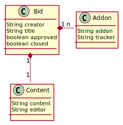

# Actor Oriented Architecture for Enterprise Applications 

## 问题

针对用户需求，应用软件要完成若干用户任务，这些任务的实现一般成为应用逻辑或业务逻辑。这些业务逻辑协调用以表达领域概念的对象来解决问题[1]。

例如一个商业公司提出"投标过程管理"需求，当公司业务代表通过招标信息发现商机之后，需要向公司汇报该商机，经公司领导审批通过后，执行投标过程，
并在后续过程中不断跟踪投标过程，直到成功或失败。 这个业务逻辑可以用一个流程图或者一个状态转移图来建模，如下所示。

该业务逻辑对应的领域概念可以有多种建模方法，例如建模为`Bid`、`Content`和`Addon`三个类型的一个聚合体（Aggregate）。如下图所示。

一般我们还会在`Bid`这个领域模型中实现一些领域逻辑，例如为`Bid`设置标题（`setTitle:String`）、设置审批通过状态(`setApproved:boolean`)、
更新内容(`setContent:Content`)或添加一个追踪记录(`addAddon:AddOn`）等。这些领域逻辑可以实现在`Bid`内，也可以在领域模型之上在封装一层服务(Service)。
如前所述业务逻辑执行过程就是协调领域对象（包括领域模型对象和领域服务）的过程，如下图所示。

通过这一协同过程投标过程管理的需求可得以实现。不过其中隐含的一个问题是，这一协同过程往往需要人或其他实体的参与（提供数据或一些额外的领域逻辑），
例如执行投标管理的第一步调用服务层`editBid`并进而调用模型层`setContent`时需要提供内容，而这些内容须由相关业务人员提供。因此实际系统可能实现为下图所示。

在这种模式下，应用逻辑的执行在部分阶段中退化为一个被动的状态记录，而不是主动的协调者。参与业务逻辑执行过程中，用户作为主体需要重复获取应用状态、
根据状态主动调用其他服务驱动应用向前。这其中主要的问题在于，协同的语义无法有效实施。

在协同中，我们一般需要表达以下语义：

- 一个应用逻辑包括哪些
- 某状态下，需要执行什么任务
- 执行某个任务，需要什么样的参与者。例如一个审批任务被动协同过程中，用户采用轮询方式来获知是否存在协同任务。
- 协同模式是什么。例如一个任务是特定用户参与还是任一用户参与亦或是大多数用户参与。

[1] Evans, E. (2004). Domain-Driven Design: Tackling Complexity in the Heart of Software. Addison-Wesley. 

