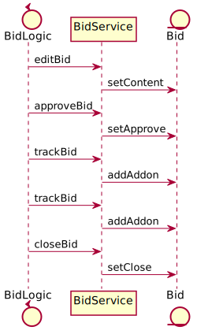

# Chartd

## 问题

[//]: # (针对用户需求，应用软件要完成若干用户任务，这些任务的实现一般成为应用逻辑或业务逻辑。这些业务逻辑协调用以表达领域概念的对象来解决问题[1]。)

某商业公司提出"投标过程管理"需求：当公司业务代表通过招标信息发现商机之后，需要向公司汇报该商机，经公司领导审批通过后，执行投标过程，
并在后续过程中不断跟踪投标过程，直到成功或失败。 这个业务逻辑（或业务过程）可以用一个流程图或者一个状态转移图来建模，如下所示。

这一业务过程对应的是"投标"这一业务对象（按DDD[1]书中所述也可称作领域模型）的管理过程。我们可以将其建模为`Bid`、`Content`和`Addon`三个类型的一个聚合体（Aggregate）。如下图所示。

> 上面这个模型只是一种选择，你也可以设计别的模型去表示一个"投标"对象。此外，一个业务过程也可以对应多个业务对象的管理，这些多个对象间可以存在或者不存在关系。
在后续介绍的应用框架设计都可以映射到这些情况上。我们在此用一个聚合类来举例并不失一般性。

在`Bid`这个领域模型之中我们还会实现一些领域逻辑，例如为`Bid`设置标题（`setTitle:String`）、设置审批通过状态(`setApproved:boolean`)、
更新内容(`setContent:Content`)或添加一个追踪记录(`addAddon:AddOn`）等。这些领域逻辑可以实现在`Bid`内，也可以在领域模型之上在封装一层服务(Service)。
这一`Bid`管理业务执行过程（我们称为`BidLogic`)就是按业务逻辑调用服务的过程，如下图所示。

> 如果领域模型设计为多各类或者领域逻辑实现为多个服务，那业务过程就是依次调用多个服务的过程，或称为对领域对象进行协同协调的过程。我们在此用一个服务距离同样不失一般性。

通过这一协同过程投标过程管理的需求可得以实现。我们可以采用主流的BPMN（或其他业务建模语言）对`BidLogic`这一的协同过程建模，
并在BPMN流程引擎中执行之。其中的各个节点可以实现为`Service Task`或者`User Task`或者`Manual Task`等Activity。

采用流程模型加流程引擎来实现这样的业务系统开发是当前企业应用开发中常见模式。然而这其中存在的一个问题是，类似`BidLogic`这样的业务过程中一个或多个业务活动
需要人或其他实体的参与（提供数据或一些额外的领域逻辑）， 例如执行投标管理的第一步调用服务层`editBid`并进而调用模型层`setContent`时需要提供内容，
而这些内容须由相关业务人员提供。因此在实际开发中业务过程可能成为下图所示。

在这种模式下，应用逻辑的执行在部分阶段中退化为一个被动的状态记录，而不是主动的协调者。参与业务逻辑执行过程中，用户作为主体需要重复获取应用状态、
根据状态主动调用其他服务驱动应用向前。这其中主要的问题在于，协同的语义无法有效表达并实施。具体而言：

- 一个活动/状态下需要谁参与没有明确定义。应用逻辑执行的每个状态下需要执行的任务需要明确规约主客体，当前BPMN等流程模型对于服务型任务会默认流程引擎为执行主体，对用户任务更是对主客体皆无显式定义（用户授权本质上并不是这个层面的概念）；
- 一个活动/状态下的参与者怎么协同没有明确定义。每个状态下的参与方之间的交互协议（输入什么输出什么）并不在应用逻辑中表达，如果涉及多个参与者他们间的关系缺乏明确表达和具体实施方法，例如"多数表决"如何表达并实施。

总体而言，现有的BPMN等流程模型所描述的应用逻辑执行过程中存在大量隐式假设，特别是在涉及人这样的主动实体的场景支持较差。这其中的根本原因在于，我们在应用系统的领域模型中单纯建立信息空间相关实体的模型，而缺乏针对物理空间和人的建模。

## 面向Actor的业务架构

上述业务过程

[1] Evans, E. (2004). Domain-Driven Design: Tackling Complexity in the Heart of Software. Addison-Wesley. 

