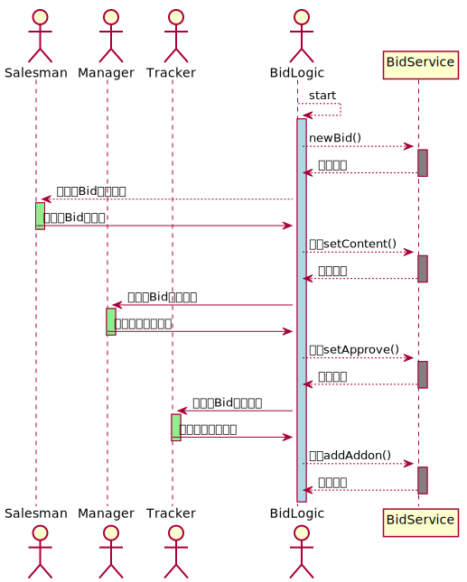

# Chartd

## 问题

某商业公司提出"投标过程管理"需求：当公司业务代表通过招标信息发现商机之后，需要向公司汇报该商机，经公司领导审批通过后，执行投标过程，
并在后续过程中不断跟踪投标过程，直到成功或失败。 这个业务逻辑（或业务过程）可以用一个流程图或者一个状态转移图来建模，如下所示。

这一业务过程对应的是"投标"这一业务对象（按DDD[1]书中所述也可称作领域模型）的管理过程。我们可以将其建模为`Bid`、`Content`和`Addon`三个类型的一个聚合体（Aggregate）。
如下图所示。

> 上面这个模型只是一种选择，你也可以设计别的模型去表示一个"投标"对象。此外，一个业务过程也可以对应多个业务对象的管理，这些多个对象间可以存在或者不存在关系。
在后续介绍的应用框架设计都可以映射到这些情况上。我们在此用一个聚合类来举例并不失一般性。

在`Bid`这个领域模型之中我们还会实现一些领域逻辑，例如为`Bid`设置标题（`setTitle:String`）、设置审批通过状态(`setApproved:boolean`)、
更新内容(`setContent:Content`)或添加一个追踪记录(`addAddon:AddOn`）等。这些领域逻辑可以实现在`Bid`内，也可以在领域模型之上在封装一层服务(Service)。
这一`Bid`管理业务执行过程（我们称为`BidLogic`)就是按业务逻辑调用服务的过程，如下图所示。

> 如果领域模型设计为多各类或者领域逻辑实现为多个服务，那业务过程就是依次调用多个服务的过程，或称为对领域对象进行协同协调的过程。我们在此用一个服务距离同样不失一般性。

通过这一协同过程投标过程管理的需求可得以实现。采用流程模型加流程引擎来实现这样的业务系统开发是当前企业应用开发中常见模式，
我们可以采用主流的BPMN（或其他业务建模语言）对`BidLogic`这一的协同过程建模， 并在BPMN流程引擎中执行之。
其中的各个节点可以实现为`ServiceTask`或者`UserTask`或者`ManualTask`等活动。前文中第一张业务流程图中包含了四个活动(`created`看成是初始状态无需活动干预)，
其中`editing`、`reviewing`和`tracking`需要用户参与（提供数据或一些额外的领域逻辑），例如editing状态下需要相关业务人员给定内容并调用服务层`setContent`方法完成一次编辑活动。

BPMN模型本身并没有给出规范如何让用户参与这些任务，不同的BPMN引擎实现给出了不同的扩展，例如在Activiti中可以通过扩展定义任务所指派的一个或多个执行者，
简单任务可以定义一个表单，复杂任务则通过任务监听器（`TaskListener`)实现将任务委托给外部代码执行。这两种方式在实际应用开发时都比较难以实现对该任务下对用户协同参与。
采用表单收集用户输入只将输入数据保存在流程实例对象中，缺乏直接机制再次调用服务方法传入数据；向外委托任务执行则需要开发一套独立的交互逻辑。

因此大多数情况下此类任务被建模为`ManualTask`更为合适，实际开发中业务过程可能成为下图所示。

在这种模式下，应用逻辑的执行在部分阶段中退化为一个被动的状态记录，而不是主动的协调者。参与业务逻辑执行过程中，用户作为主体需要重复获取应用状态、
根据状态主动调用其他服务驱动应用向前。 

简言之，现有的BPMN等流程模型所描述的应用逻辑执行过程并不适用于涉及人这样的主动实体的业务场景，这其中的根本原因在于我们在应用系统的领域模型中
单纯建立信息空间相关实体的模型，而缺乏针对物理空间和人的建模，导致流程引擎等业务逻辑执行体无法直接同时协同信息空间和现实空间的多元主体。

## 面向Actor的业务架构

如上所述，采用BPMN这类模型较为适合建模并执行可自动化（例如仅包含服务调用等）的业务逻辑，但面向涉及用户参与的业务时往往退化为一个活动划分或者状态记录模型时。
因此我们需要有更合适的软件抽象与架构来表达并实现业务逻辑运行中的业务实体协同（包括参与者及他们间的交互协议等）。

### 基于Actor的应用抽象

因业务逻辑本质上就是在某个应用领域中协同领域概念（领域模型与领域服务）以实现业务目标[1]，因此我们可以将所设计的领域概念及业务逻辑都建模为`Actor`[2]，
业务逻辑依靠Actor间发送并处理消息来推动执行。具体Actor模式概念与实现框架可以参考Akka[3]。前述投标管理逻辑可以Actor建模如下图所示。

### 面向Actor的协同逻辑

投标管理业务`BidLogic`作为一个业务执行者的隐喻（metaphor）负责管理业务执行状态，在特定的业务状态下与各个业务参与方进行交互促成其间协同。
例如`Bid`创建伊始，要求Salesman填写`Bid`内容，然后将填好内容的`Bid`对象呈现给Manager进行审批，等。当然对于本身就是信息空间的`BidService`，
`BidLogic`可以直接同步调用其服务（这里我们也可以把`BidLogic`与`BidService`间的关系看作Clean Architecture中的`Interactor`与`Entity`间的关系），
因此上述协同过程在此例中可简化为如下图所示（如果`BidService`的调用存在异步模式和并发事务控制等问题， 也应该将其实现为独立的`Actor`，这也是Actor模式提出的初衷）。

上图中，`BidLogic`与`Salesman`、`Manager`、`Tracker`均为可以接受和发送消息的Actor，`BidService`为普通服务。
`BidLogic`需协同另外三个Actor时，对其发出消息，消息内包含协同所需要上下文信息（例如`Bid`对象状态），Actor收到消息后进行相应处理并返回协同结果。
这样的抽象是符合现实直觉的，图中的四个`Actor`直接对应现实空间中的各个协作实体，`BidLogic`负责主持，其他参与。

### 协同语义

这其中隐含的一个问题是：如何定义协议，即作为协调者的`BidLogic`如何告诉其他Actor当前需要做什么，Actor处理完消息后返回的结果`BidLogic`如何理解，
更简单来说就是参与协同者分别期待输入什么输出什么。我们可以采用现有的设计模式来表达协同语义（输入输出），例如采用Clean Architecture[4]中的Request+Response Model对定义为一个实体对外的协同接口。

针对此例`BidServer`这一信息空间领域模型的管理业务，我们采用CQRS模式[5]来进行协议定义。因为Actor协同的最终目的是通过`BidService`完成对Bid的管理，
`BidLogic`对外发出的消息可以看作是对`Bid`的一个查询（以让其他Actor了解`Bid`的状态），而接收的则是发往`Bid`的一个命令（以改变`Bid`的状态）。 
之所以这么选择是因为当前`BidService`这一的领域逻辑实现本身就会采用CQRS+Event Souring的模式进行实现，可以与基于Actor的协同逻辑直接匹配。

> 不推荐将`BidServer`实现为一个CRUD服务，一方面CRUD模式下难以实现CQRS对读写分离的支持，另一方面CRUD的接口对业务语义的表达较弱。

### 业务的关注分离

面向Actor的协同模式使得我们可以进一步实现关注分离，特别是采用BPMN流程引擎难以实现的"中国式流程"。因为`在每个协同活动

- [1] Evans, E. (2004). Domain-Driven Design: Tackling Complexity in the Heart of Software. Addison-Wesley.
- [2] Hewitt, Carl; Bishop, Peter; Steiger, Richard (1973). "A Universal Modular Actor Formalism for Artificial Intelligence". IJCAI.
- [3] How the Actor Model Meets the Needs of Modern, Distributed Systems. https://doc.akka.io/docs/akka/current/typed/guide/actors-intro.html
- [4] Robert C. Martin. 2017. Clean Architecture: A Craftsman's Guide to Software Structure and Design (1st. ed.). Prentice Hall Press, USA.
- [5] Martin Fowler. Command Query Separation. https://martinfowler.com/bliki/CommandQuerySeparation.html
- [6] Martin Fowler. Event Souring. https://martinfowler.com/eaaDev/EventSourcing.html